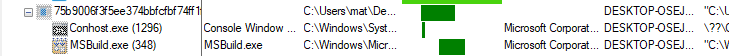
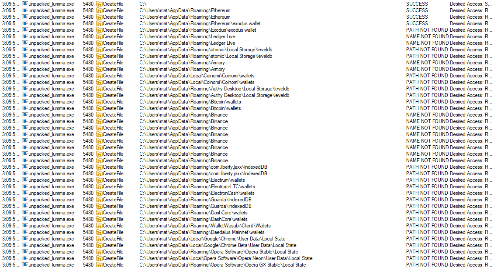
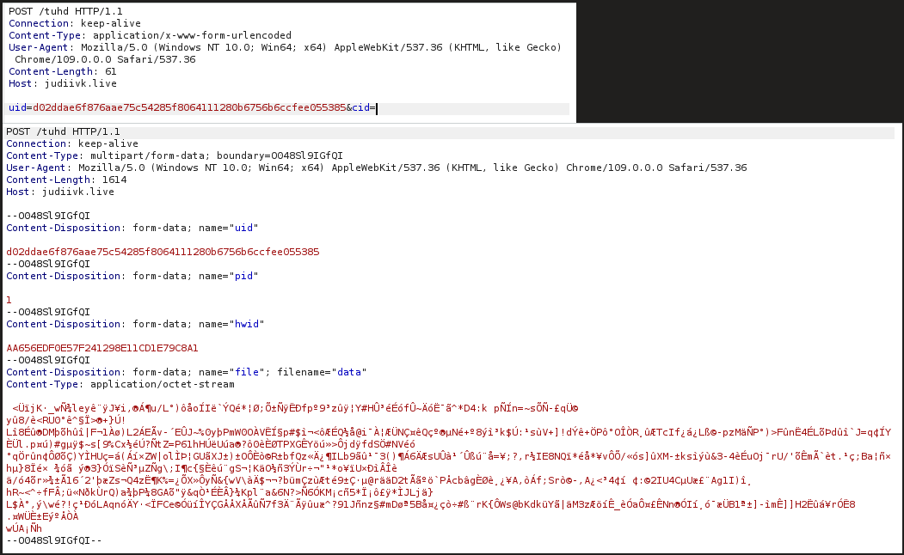

## Process Injection
- creates `msbuild.exe` 32-bit process and reflectively load LummaStealer executable into it.


- trys to look for stored crypto currency wallets and browser creds and cookies.


## Network Activity




# IOCs


```
https://judiivk.live/tuhd
https://narrathfpt.top/tekq
https://escczlv.top/bufi
https://caitraohvi.bet/adks
https://galijd.shop/anbf
https://ordntx.top/pxla
https://strejqt.bet/mbnj
https://citellcagt.top/gjtu
https://maxmtsq.bet/xzid


https://steamcommunity.com/profiles/76561199855957015

Mozilla/5.0 (Windows NT 10.0; Win64; x64) AppleWebKit/537.36 (KHTML, like Gecko) Chrome/109.0.0.0 Safari/537.36
```
